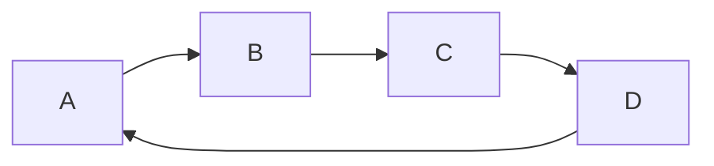

输入某二叉树的前序遍历和中序遍历的结果，请重建该二叉树。假设输入的前序遍历和中序遍历的结果中都不含重复的数字。

例如，给出`前序遍历 preorder = [3,9,20,15,7]
中序遍历 inorder = [9,3,15,20,7]`

返回如下的二叉树：
`   3
    / \
   9  20
     /  \
    15   7`
    


    
限制：
`0 <= 节点个数 <= 5000`

```java
    /**
     * Definition for a binary tree node.
     * public class TreeNode {
     * int val;
     * TreeNode left;
     * TreeNode right;
     * TreeNode(int x) { val = x; }
     * }
     */
    class Solution {
        public TreeNode buildTree(int[] preorder, int[] inorder) {
            List<Integer> pre = new ArrayList<>();
            //先把数组转为集合，方便接下来的截取
            for (int i : preorder) pre.add(i);
            List<Integer> in = new ArrayList();
            //先把数组转为集合，方便接下来的截取
            for (int j : inorder) in.add(j);
            //传入前，中序遍历节点集合，递归构建二叉树
            return recursive(pre, in);
        }

        public TreeNode recursive(List<Integer> pre, List<Integer> in) {
            if (pre.size() == 0) return null;
            
            //前序遍历的第一个节点一定是树的根节点
            TreeNode root = new TreeNode(pre.get(0));
            //获取根结点在中序遍历中的索引，索引左边是树的左子树，索引右边是树的右子树
            int middle = in.indexOf(root.val);

            //根据中序遍历的左右子树的节点个数，同理获取前序遍历的左右子树的节点集合
            root.left = recursive(pre.subList(1, 1 + middle),
                    in.subList(0, middle));
            root.right = recursive(pre.subList(1 + middle, pre.size()),
                    in.subList(middle + 1, in.size()));

            return root;
        }
    }
```


